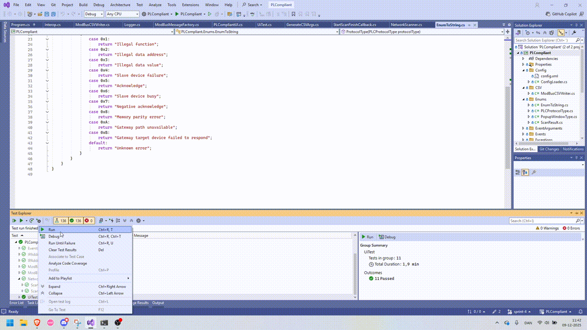

# PLCompliant

This project is for reading firmware versions on embedded PLCs in industrial environments. You need .NET Runtime 9 in order to run this application. 

This is how the application looks while running (do mind the GIF-compression though)

