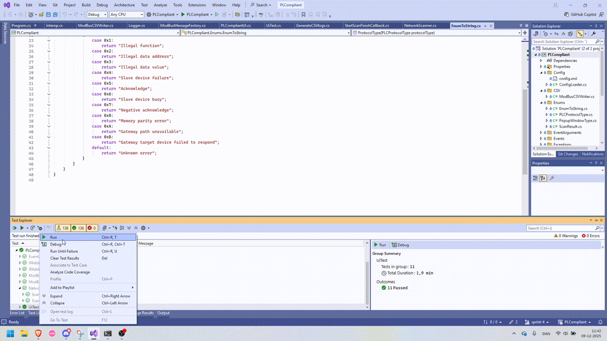

# PLCompliant

This project is for reading firmware versions on embedded PLCs in industrial environments. You need .NET Runtime 9 in order to run this application.

This is how the application looks while running (do mind the GIF-compression, though!)

## Debugging or cloning the project
If you want to test or debug the application, please clone the repository to %USERPROFILE%/source/repos on your Windows system (or just your user directory if cloning using Visual Studio's built in Git manager). If you want to properly run the application, unit tests or UI test automation, please program a Modicon M340 and set it to IP 192.168.123.100 as well as a Siemens S7-PLC with a 1200-series CPU and set it to IP 192.168.123.99.
To run unit tests and UI automation tests, download and run [Windows Application Driver (64)](https://github.com/microsoft/WinAppDriver/releases) (dependency to drive the tests.) 

## Config of logging
If you want to have more or less verbose logging than the standard setting, "critical", please go configure `logging_level` inside `bin\Debug\net9.0-windows\config.xml` OR `bin\Release\net9.0-windows\config.xml`.   
Please try out any of available options below: 
>* verbose
>* warning
>* error
>* all
>* critical (default)
>* off

## Downloading and running the application
If you'd rather just attempt running it for yourself, please download [release 1.1](https://github.com/NathiNugget/PLCompliant/releases/download/1.1/PLCompliant_v1.1.zip) and run either the Release or Debug build inside, the choice is yours :)  

### Debug-build
>Please run **PLCompliant-exe** inside `bin\Debug\net9.0-windows` if you want debug-flags.
### Release-build 
>Run **PLCompliant.exe** inside `bin\Release\net9.0-windows` if you want to run the official release build. 

## Docs
XML-based documentation inside Visual Studio is available.

